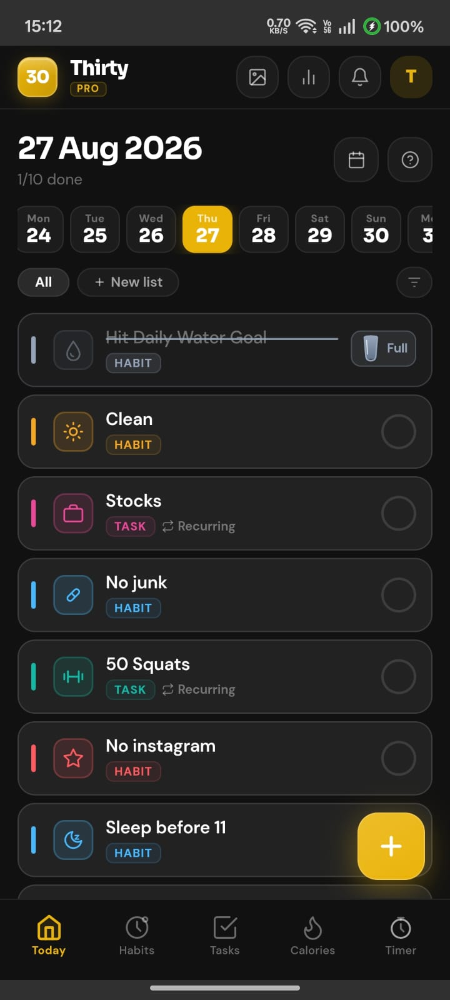
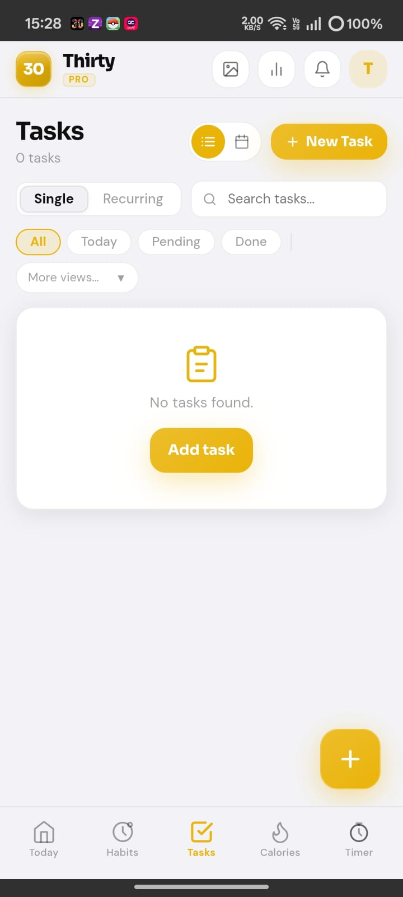
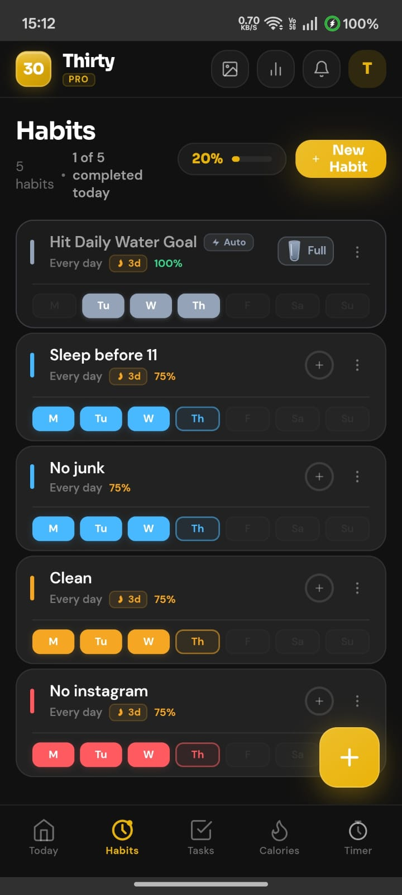
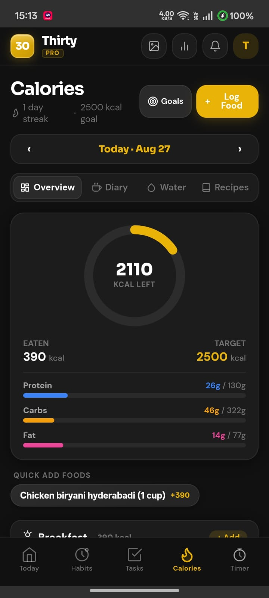
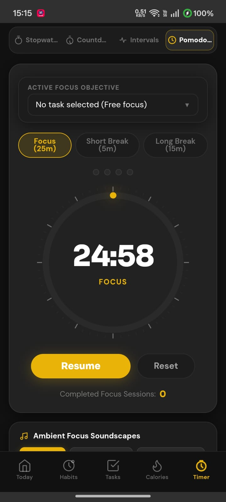
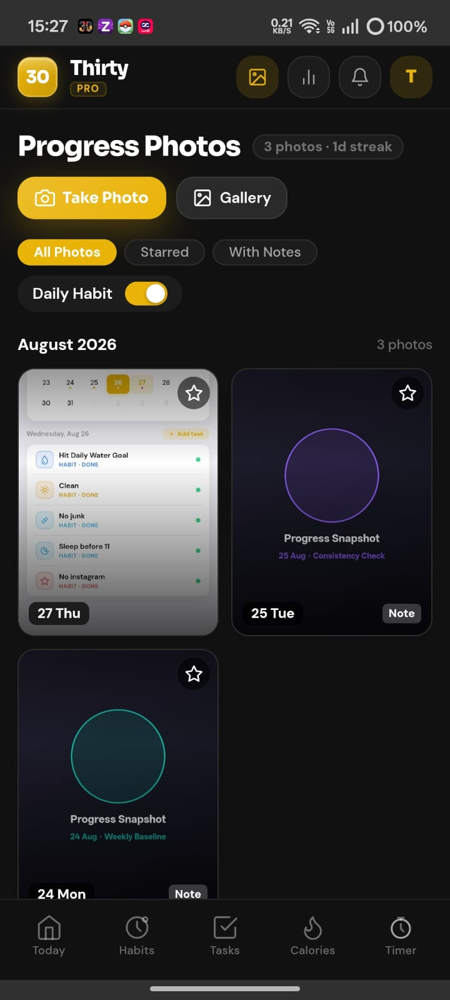

# ⚡ THIRTY (30-ECO)

<p align="center">
  
  
  
  
</p>

<h3 align="center">
  <b>The All-in-One Life Operating System.</b>
</h3>

<p align="center">
  Thirty unites precision task scheduling, atomic habit loops, scientific macro calculations, hardware foreground focus timers, and private visual body transformation diaries into one seamless native experience.
</p>

<p align="center">
  <a href="https://30-landing.vercel.app/"><b>🌐 Visit Live Portal</b></a> •
  <a href="https://30-landing.vercel.app/thirty-app.apk"><b>📥 Download APK (9.8 MB)</b></a> •
  <a href="#-visual-showcase"><b>📸 View Screenshots</b></a>
</p>

---

<br />

## 📱 Visual Showcase

<div align="center">

| **⚡ Horizon Today Agenda** | **🎯 Precision Tasks** | **🔄 Atomic Habits** |
| :---: | :---: | :---: |
|  |  |  |

<br />

| **🥗 Scientific Macro Diary** | **⏱️ Focus Engine** | **📸 Private Photo Diary** |
| :---: | :---: | :---: |
|  |  |  |

</div>

<br />

---

<br />

## ✨ The 30-ECO Core Highlights

<br />

### 1. 📅 Horizon Today Agenda
> **Zero friction. Absolute daily clarity.**
- Consolidates tasks, recurring items, habit routines, water logging, and progress photos into one intuitive daily timeline.
- Hardware-accelerated Framer Motion gesture physics with scoped drag handles.
- Bi-directional auto-completion: logging calories or capturing a photo automatically ticks your agenda.

<br />

### 2. 🥗 Scientific Calorie, Macro & 43-Nutrient Clinical Engine
> **Exact mathematics. Clinical nutritional depth.**
- Strict caloric equilibrium formula:
  $$\text{Calories} = (\text{Protein} \times 4) + (\text{Carbs} \times 4) + (\text{Fats} \times 9)$$
- **2,233+ USDA & ICMR-Verified Foods**: Massive local-first offline nutrition database covering Indian regional dishes, global staples, and healthy snacks.
- **Complete 43-Nutrient Bioactive Spectrum**: Tracks Vitamins (C, D, B12, A, B6, Folate B9, etc.), Minerals (Iron, Calcium, Potassium, Magnesium, Zinc, etc.), Healthy Fats, Fiber, and Hydration.
- **Dynamic RDA Scaling & Contributor Drill-Down**: Real-time personalized RDA calculations based on age, gender, and activity with interactive food contributor breakdowns.
- Responsive portion multipliers (`0.5x`, `1x`, `1.5x`, `2x`) with custom recipe builder.

<br />

### 3. ⏱️ Hardware Foreground Focus Engine
> **Zero timer drift. Zero OS interruptions.**
- Android 14+ native Foreground Service keeps Stopwatch, Countdowns, and Pomodoros alive in your system notification tray.
- Interactive notification actions (Pause, Resume, Stop) via native PendingIntents.
- Built-in ambient audio generator: *Rainstorm*, *Deep Focus*, *Alpha Waves 40Hz*, and *Forest Stream*.

<br />

### 4. 📸 Private Visual Transformation Diary
> **100% on-device. Zero cloud exposure.**
- High-resolution hardware camera integration with client-side canvas compression.
- Google Photos style month-by-month transformation timeline with starred milestones.
- Stored exclusively in local sandboxed IndexedDB storage.

<br />

### 5. 📲 Android 14+ Native Home Screen Widgets
> **Your day, right on your home screen.**
- Tasks & Habits RemoteViews AppWidgets that automatically reflect your chosen dark, ultra-dark, or light themes.
- Real-time SharedPreferences bridge broadcasting instant state updates on every tap.

<br />

---

<br />

## 🚀 Direct Android Installation

1. **Download APK**: Tap the direct download button on **[30-landing.vercel.app](https://30-landing.vercel.app/)** or download `thirty-app.apk`.
2. **Open Package**: Tap the completed download in your notifications or Files app.
3. **Allow Source**: If prompted by Android, enable *"Install Unknown Apps"* for your browser.
4. **Launch Thirty**: Enjoy the fastest, most private life operating system on Android.

<br />

---

<br />

## 📦 Deployment & Repository Structure

```
30-landing/
├── index.html            # Luxury dark glassmorphic landing page
├── thirty-app.apk        # Standalone production Android binary (v2.0.0)
├── 30-app.apk            # Direct mirror APK binary
├── screenshots/          # 52 Accurately named high-resolution screenshots
└── README.md             # Advertisement showcase document
```

<br />

---

<br />

<p align="center">
  <b>Crafted with precision by Hemanth NR</b><br />
  <sub>Thirty Ecosystem · 2026</sub>
</p>
