# ⚡ LOCK IN — THE 1% PERFORMANCE ENGINE

  
  
  
  
  

<h2 align="center">
  <b>Master the 1% Standard. The Personal Life Engine.</b>
</h2>

  <b>Lock In</b> is an elite, local-first performance engine uniting atomic habit loops, precision task routines, a 43-nutrient clinical nutrition system, body weight & progress photo transformation tracking, hardware focus timers with binaural soundscapes, and comprehensive Executive Multi-Domain PDF dossiers.

  <a href="https://30-landing.vercel.app/"><b>🌐 Visit Live Portal</b></a> •
  <a href="https://30-landing.vercel.app/lock-in.apk"><b>📥 Download Production APK</b></a> •
  <a href="#-visual-showcase"><b>📸 View Screenshots</b></a> •
  <a href="#-the-6-pillars"><b>🏛️ Core Pillars</b></a>

---

 

## 📱 In-App Visual Showcase

| **📅 Horizon Today Agenda** | **🔄 Atomic Habits Tracker** | **📊 Insights & 1% Index** |
| :---: | :---: | :---: |
| 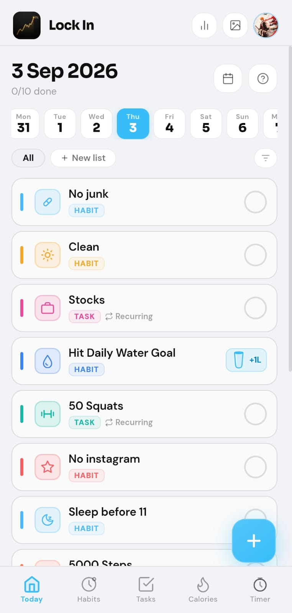 | 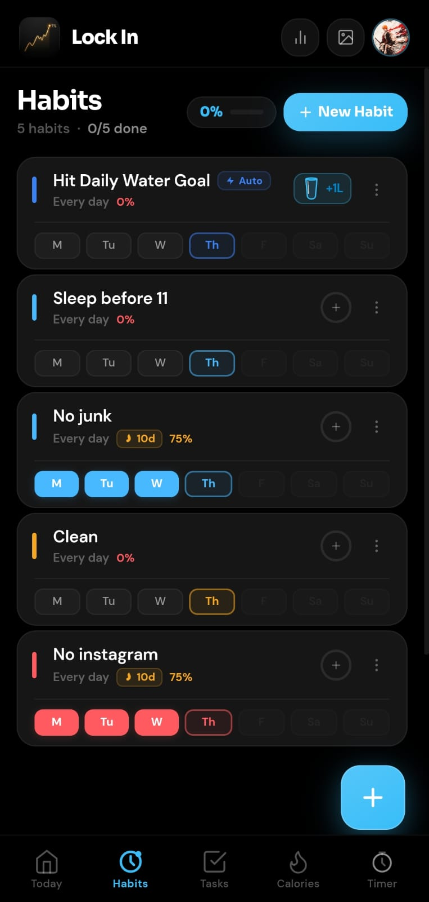 | 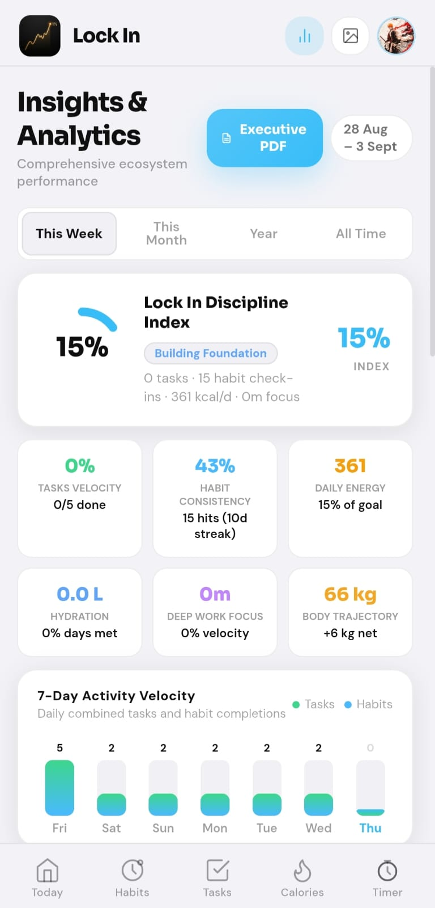 |

 

| **🥗 43-Nutrient Clinical Engine** | **📸 Progress & Weight Log** | **📄 Executive PDF Dossier** |
| :---: | :---: | :---: |
| 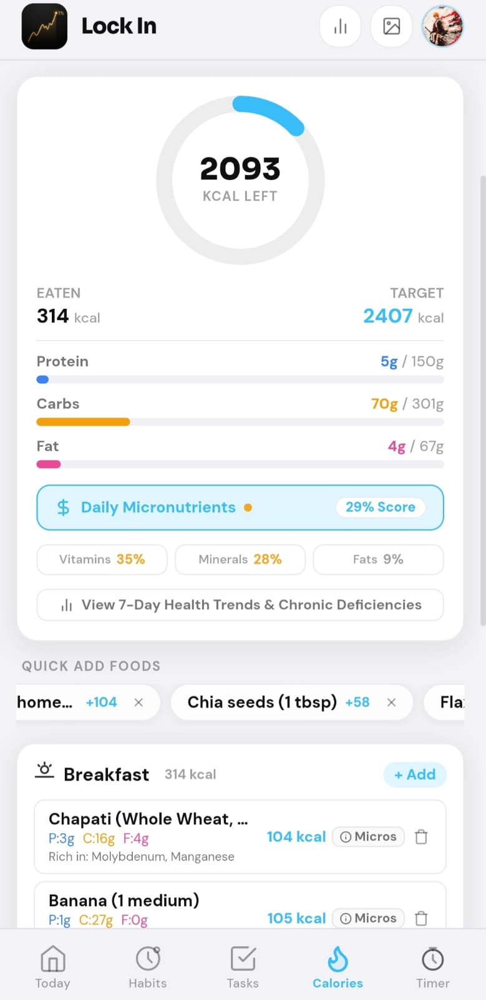 | 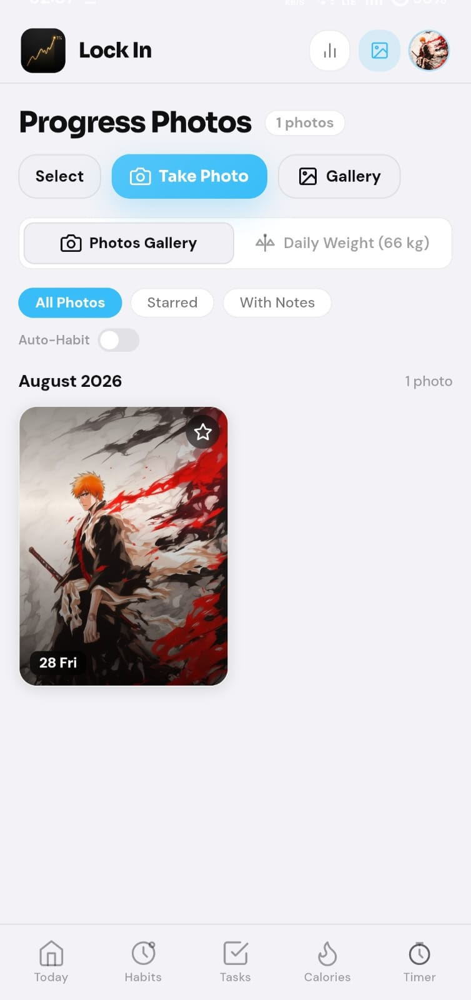 | 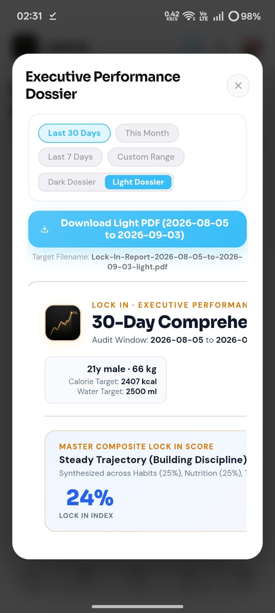 |

 

| **🎯 Recurring Tasks & Routines** | **⏱️ Intervals & Soundscapes** | **🏆 Rewards & Mastery XP** |
| :---: | :---: | :---: |
| 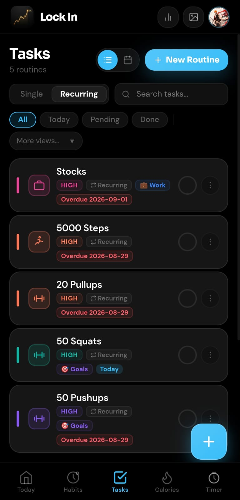 | 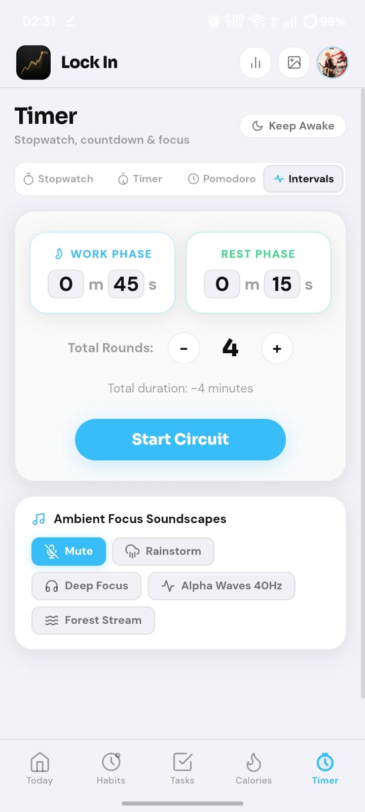 | 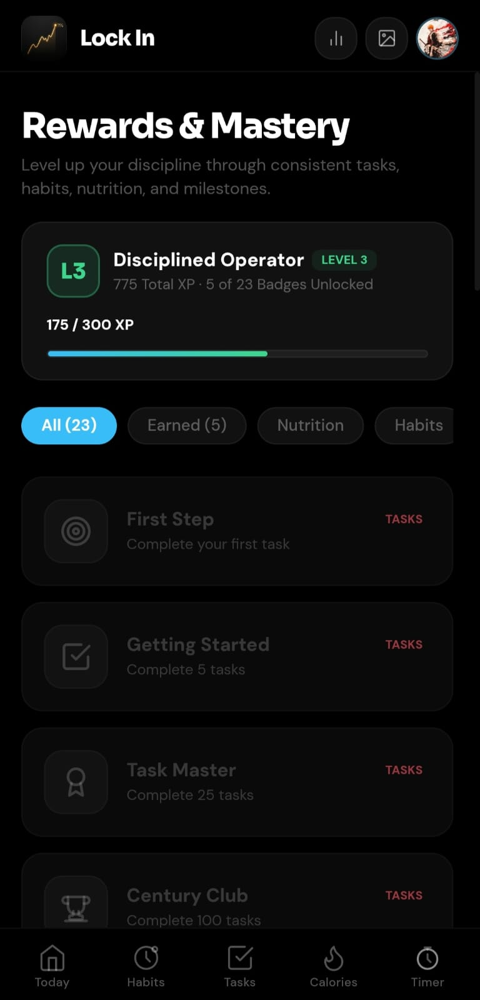 |

 

| **📂 Categories Manager** | **📝 Notes & Private Vault** | **🎨 Theme & Haptic Settings** |
| :---: | :---: | :---: |
| 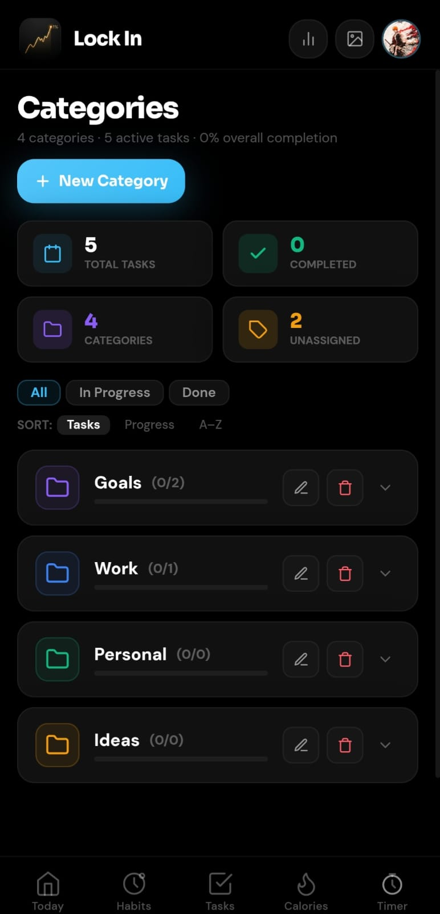 | 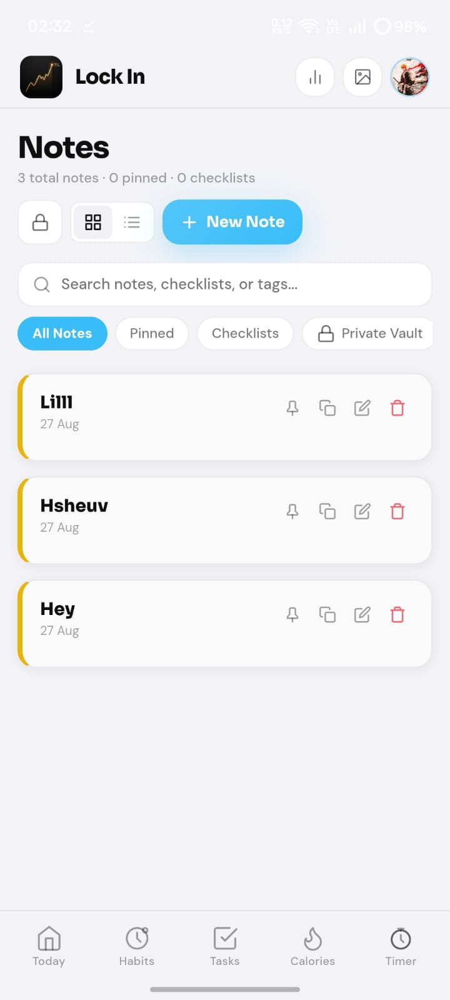 | 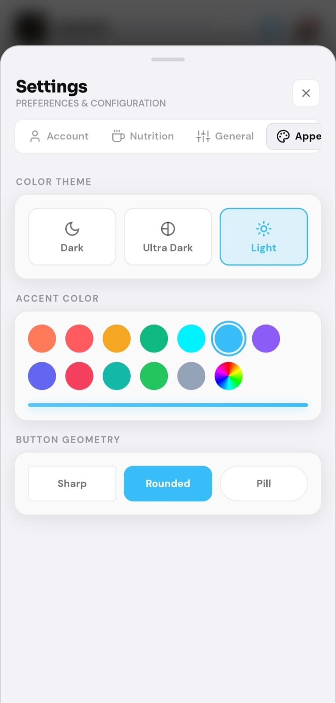 |

---

 

## 🏛️ The 6 Pillars of Lock In

### 1. 📅 Horizon Today Agenda
> **Zero friction. Absolute daily clarity.**
- Consolidates pending tasks, recurring habits, fluid intake counters, macro attainment, and photo milestones into one intuitive daily timeline.
- Bi-directional synchronization: logging water, meals, or taking a progress photo instantly marks linked habit objectives complete on Today.

### 2. 🔄 Atomic Habits & Discipline Execution
> **Consistency compounds into mastery.**
- Tracks boolean rituals, numeric counts (e.g. 50 pushups, 10 pages), fluid targets, and camera milestones.
- 7-day rolling window completion percentages, maximum streak records, and milestone mastery rewards.
- Web Audio synthesized audio chimes and native haptic vibrations on check-ins.

### 3. 🥗 Scientific Calorie, Macro & 43-Nutrient Clinical Engine
> **Exact mathematics. Clinical nutritional depth.**
- Mathematical Caloric Equilibrium:
  $$\text{Calories} = (\text{Protein} \times 4) + (\text{Carbs} \times 4) + (\text{Fats} \times 9)$$
- **2,233+ USDA & ICMR-Verified Foods**: Fast offline search covering Indian regional staples, global foods, and customized recipes.
- **Complete 43-Nutrient Bioactive Tracking**: Tracks 13 Vitamins, 9 Minerals & Electrolytes, Healthy Lipids (Omega-3, EPA, DHA), Dietary Fiber, and Hydration.
- **Category Adequacy Scores**: Real-time scores for Vitamins, Minerals, and Lipids with chronic deficiency detection.

### 4. 📈 Daily Weight Tracker & Transformation Diary
> **100% on-device. Zero cloud exposure.**
- High-resolution hardware camera integration with client-side canvas compression.
- Chronological weight logging with baseline tracking, net $\Delta$ ($kg$ and $lbs$), and trajectory modeling.
- Stored exclusively in local sandboxed IndexedDB storage.

### 5. ⏱️ Hardware Foreground Focus Engine
> **Zero timer drift. Zero OS interruptions.**
- 4 Precision Modes: Lap Stopwatch, Target Countdown, HIIT Intervals, and Pomodoro cycles.
- Android 14+ native Foreground Service keeps timers alive in your notification shade with zero OS throttling during screen sleep.
- Built-in ambient soundscapes: *Rainstorm*, *Deep Focus*, *Alpha Waves 40Hz*, and *Forest Stream*.

### 6. 📄 Executive Multi-Domain Performance Dossier (PDF)
> **Clinical-grade audit of your body and mind.**
- Dual themes: **Onyx Gold Dark Dossier** and **Clinical White Light Dossier**.
- Full multi-domain breakdown of Habits consistency, Micronutrient adequacy, Weight trajectory, Task velocity, and Focus focus minutes exported in high-res client-side PDF.

---

 

## 🚀 Direct Android Installation

1. **Download APK**: Tap the direct download button on **[30-landing.vercel.app](https://30-landing.vercel.app/)** or download `lock-in.apk`.
2. **Open Package**: Tap the completed download in your notifications or Files app.
3. **Allow Source**: If prompted by Android, enable *"Install Unknown Apps"* for your browser.
4. **Launch Lock In**: Enjoy the fastest, most private life operating system on Android.

---

 

  <b>Lock In · Master the 1% Standard</b> 
  Proprietary & Confidential · 2026

